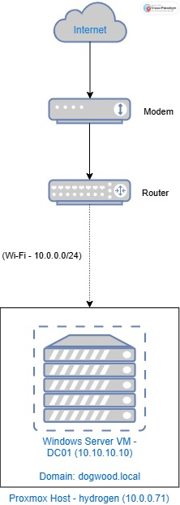

# Active Directory Lab: DogWood Solutions

This project simulates the IT infrastructure for a small company called DogWood Solutions. A Windows Server 2022 Domain Controller runs Active Directory Domain Services, DNS, and Group Policy, managing employee accounts, security groups, and company-wide policies across five departments.

Built on a Proxmox VE 9.1 home lab environment.

## What This Lab Demonstrates

- Deploying Windows Server 2022 as a virtual machine on Proxmox
- Configuring static IP and DNS settings on the server
- Installing Active Directory Domain Services and DNS
- Promoting the server to a Domain Controller
- Creating Organizational Units to reflect a company department structure
- Creating and managing users and security groups
- Configuring Group Policies (password policy, screen lock, Control Panel restriction)
- Setting up GPO inheritance and security filtering to exempt specific groups
- Enabling and connecting via Remote Desktop Protocol (RDP)

## Technologies Used

- Windows Server 2022 (Evaluation)
- Active Directory Domain Services (AD DS)
- DNS Server
- Group Policy Management (GPMC)
- Remote Desktop Protocol (RDP)
- PowerShell
- Proxmox VE 9.1

## Network Diagram

| Machine | Hostname | IP Address | Role |
|---------|----------|------------|------|
| Proxmox Host | hydrogen | 10.0.0.71 | Hypervisor, NAT Gateway |
| Windows Server VM | DC01 | 10.10.10.10 | Domain Controller, DNS, AD DS |

- Domain: dogwood.local
- Internal VM Network: 10.10.10.0/24 (NAT through Proxmox Wi-Fi)
- External Network: 10.0.0.0/24 (Home Wi-Fi)