# Active Directory Lab: DogWood Solutions

This project simulates the IT infrastructure for a small company called DogWood Solutions. A Windows Server 2022 Domain Controller runs Active Directory Domain Services, DNS, and Group Policy, managing employee accounts, security groups, and company-wide policies across five departments.

Built on a Proxmox VE 9.1 home lab environment.

## What This Lab Demonstrates

- Deploying Windows Server 2022 as a virtual machine on Proxmox
- Configuring static IP and DNS settings on the server
- Installing Active Directory Domain Services and DNS
- Promoting the server to a Domain Controller
- Creating Organizational Units to reflect a company department structure
- Creating and managing users and security groups
- Configuring Group Policies (password policy, screen lock, Control Panel restriction)
- Setting up GPO inheritance and security filtering to exempt specific groups
- Enabling and connecting via Remote Desktop Protocol (RDP)

## Technologies Used

- Windows Server 2022 (Evaluation)
- Active Directory Domain Services (AD DS)
- DNS Server
- Group Policy Management (GPMC)
- Remote Desktop Protocol (RDP)
- PowerShell
- Proxmox VE 9.1

## Network Diagram

| Machine | Hostname | IP Address | Role |
|---------|----------|------------|------|
| Proxmox Host | hydrogen | 10.0.0.71 | Hypervisor, NAT Gateway |
| Windows Server VM | DC01 | 10.10.10.10 | Domain Controller, DNS, AD DS |

- Domain: dogwood.local
- Internal VM Network: `10.10.10.0/24` (NAT through Proxmox Wi-Fi)
- External Network: `10.0.0.0/24` (Home Wi-Fi)

## Configuration Steps

### 1. Windows Server Setup
- Downloaded the Windows Server 2022 Evaluation ISO from Microsoft (180-day trial)
- Created a VM in Proxmox with 4 cores, 4GB RAM, and 50GB storage
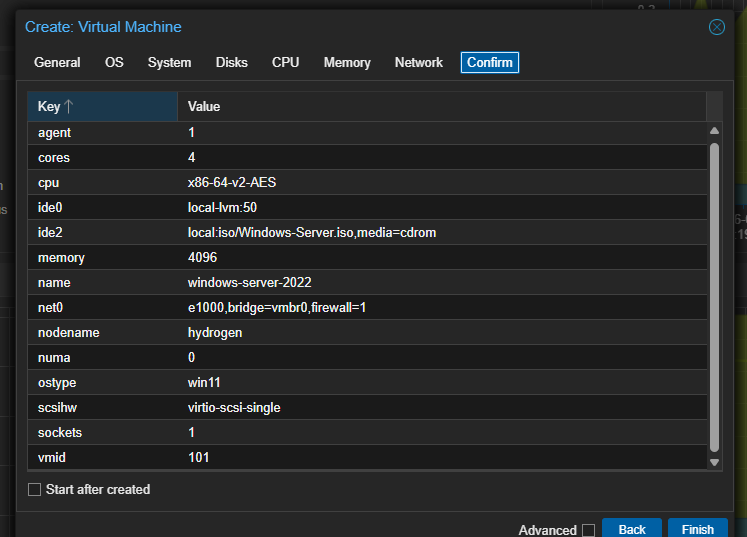
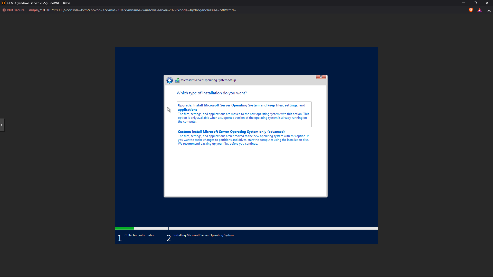
- Assigned a static IP of `10.10.10.10/24` with gateway `10.10.10.1`
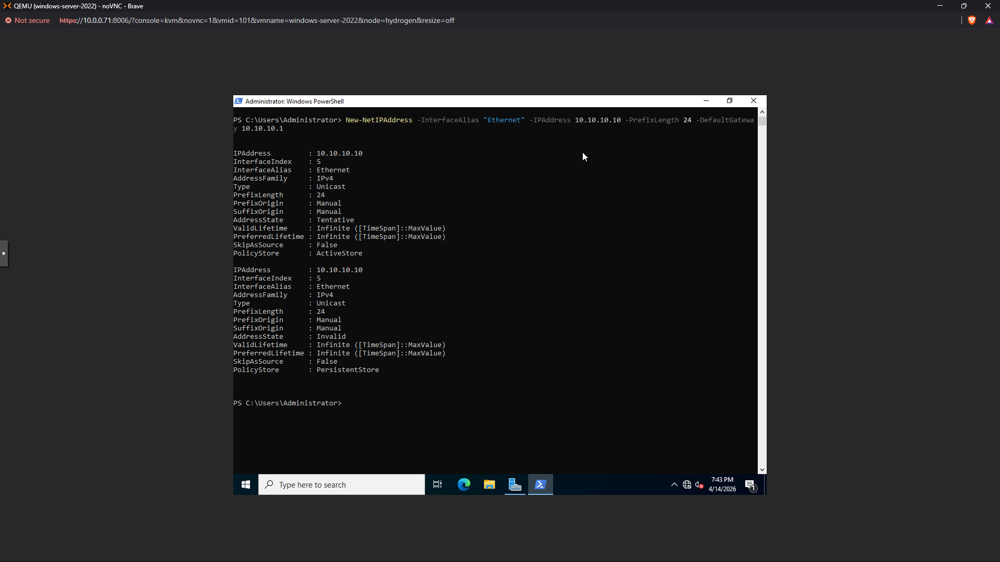
- Renamed the server hostname to DC01
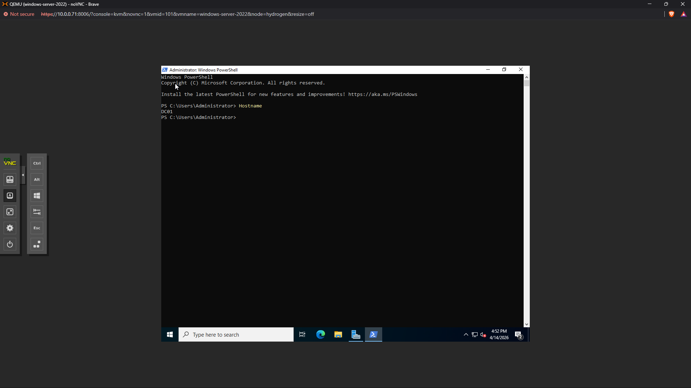

### 2. Active Directory Domain Services
- Installed AD DS and management tools via PowerShell using `Install-WindowsFeature`
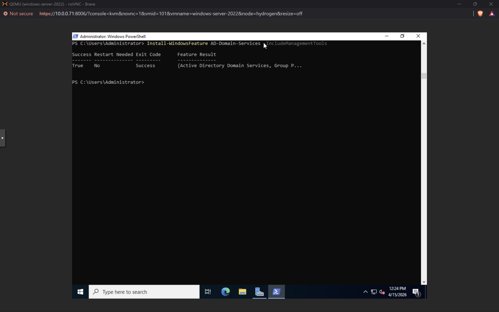
- Promoted the server to a Domain Controller using `Install-ADDSForest`
- Created the domain: `dogwood.local`
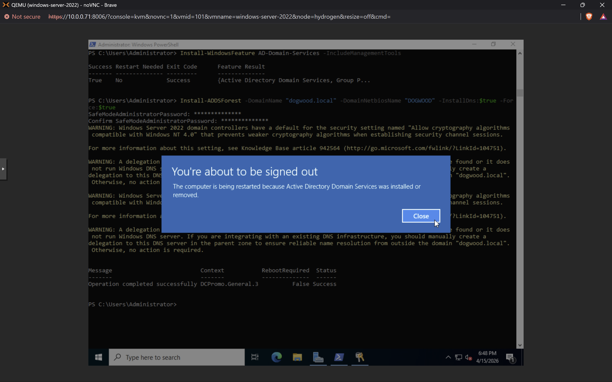
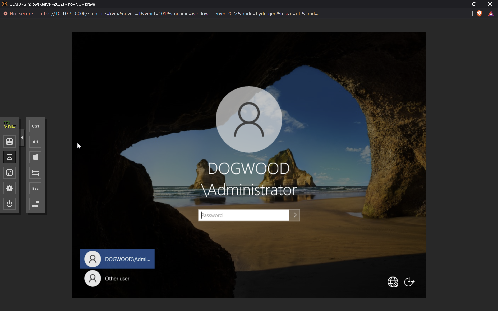

### 3. Organizational Units
- Created a parent OU called "DogWood Users" under `dogwood.local`
- Created five department OUs inside it: IT, HR, Finance, Marketing, Management
- All OUs created via PowerShell using `New-ADOrganizationalUnit`

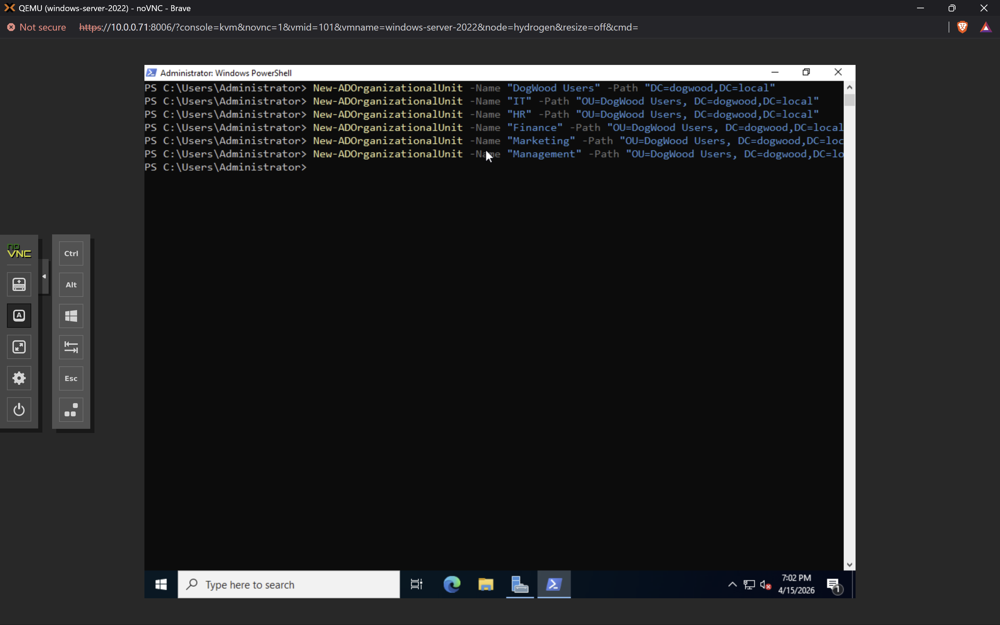
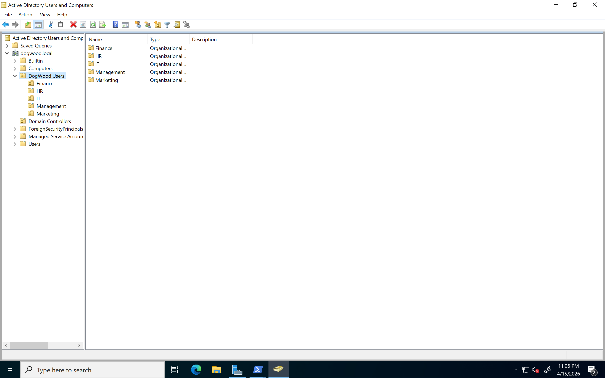

### 4. Users and Security Groups
- Created 5 security groups matching each department
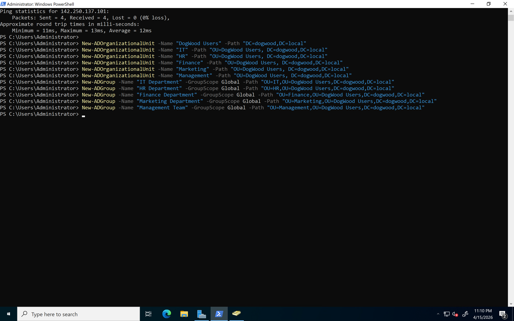
- Created 10 users across the five departments (2 per department)
- Assigned users to their respective department groups using `Add-ADGroupMember`
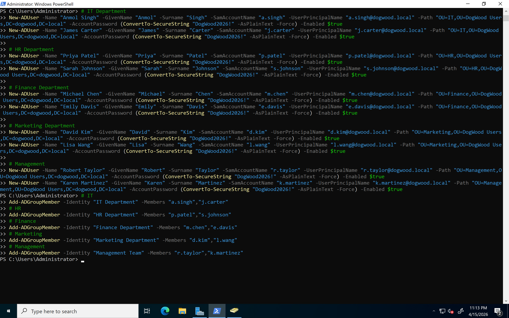
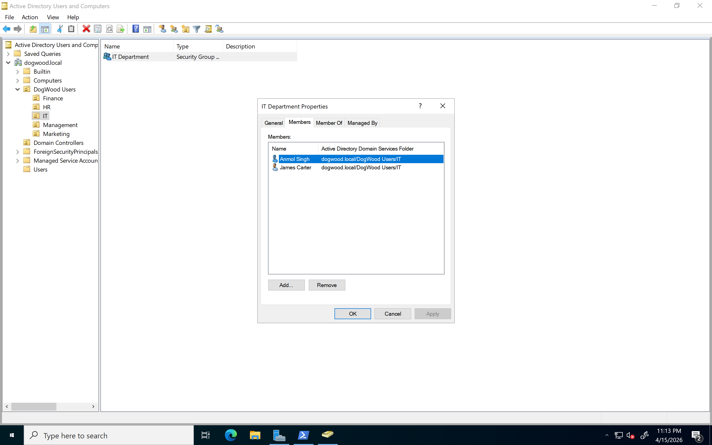

### 5. Group Policy
- **Password Policy** (PowerShell): Minimum 8 characters, complexity enabled, account lockout after 5 failed attempts for 30 minutes
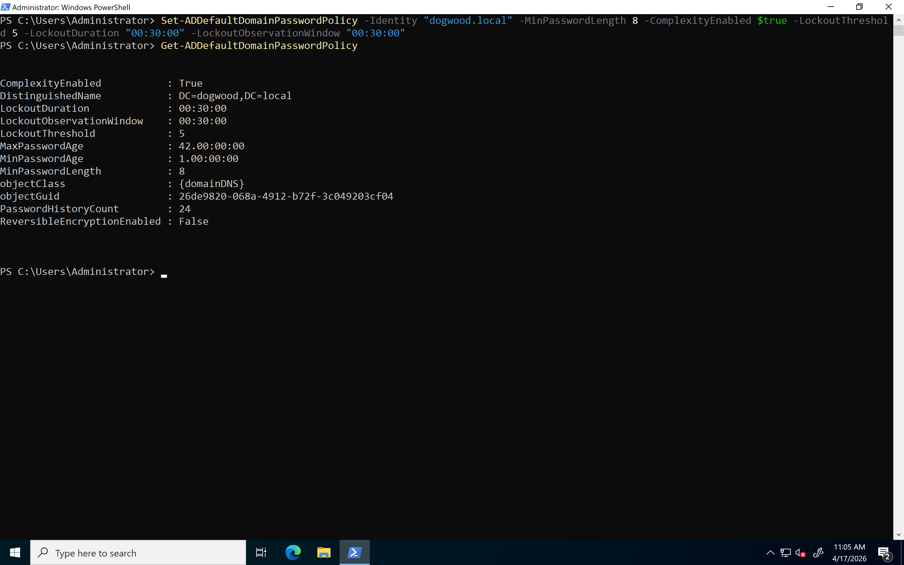
- **Screen Lock Policy** (GPMC, domain-wide): Locks screen after 5 minutes of inactivity. Applied at `dogwood.local` level so it affects all machines
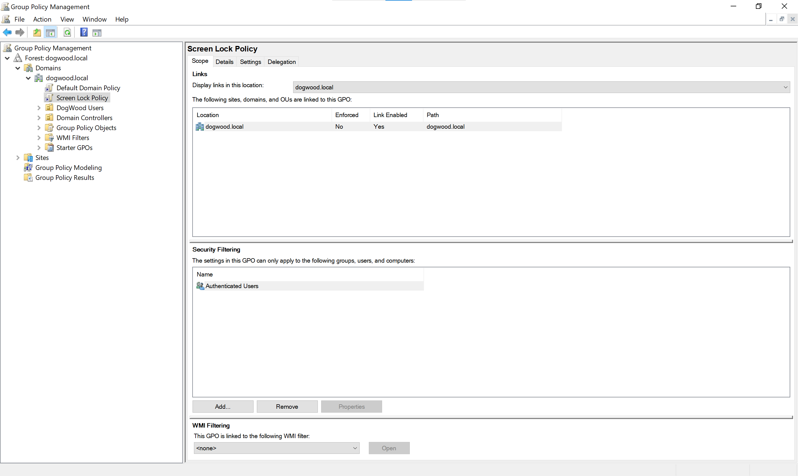
- **Restrict Control Panel** (GPMC, OU-level): Blocks Control Panel access for all users in DogWood Users OU. IT Department group is exempted using Deny on Apply Group Policy
<!-- 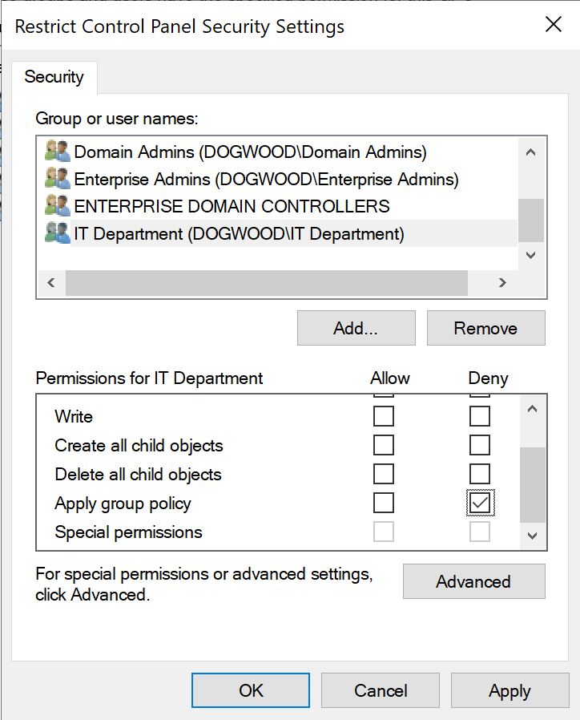 -->'

<!-- 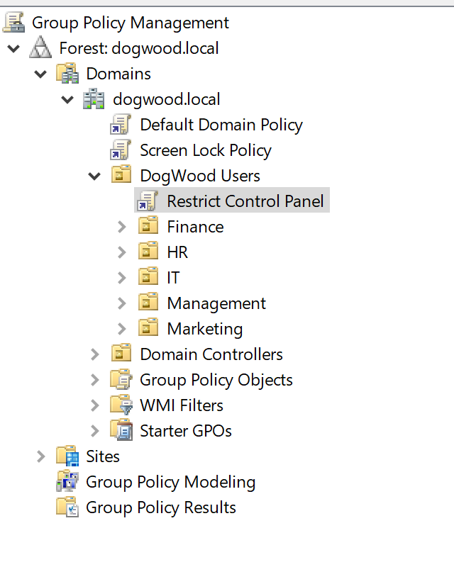-->
 

### 6. Remote Desktop Access
- Enabled RDP on Windows Server via PowerShell
- Added a network route on the laptop to reach the `10.10.10.0/24` VM network through Proxmox (`10.0.0.71`)
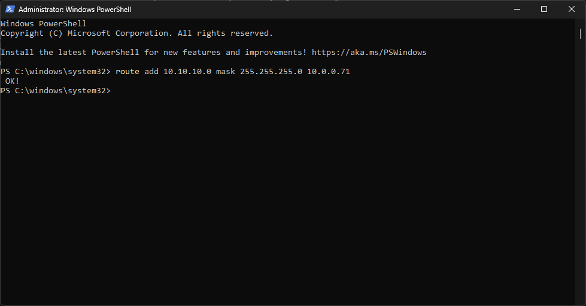
- Connected using `mstsc` to `10.10.10.10` as `DOGWOOD\Administrator`
<!-- 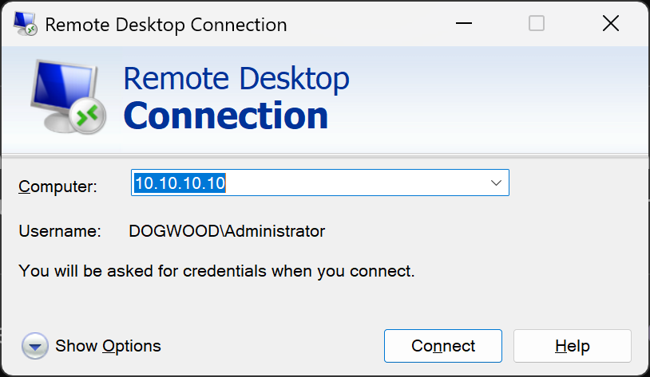 -->

## Company Structure

DogWood Solutions is a simulated small company with 10 employees across five departments:

| Department | Users | Security Group |
|-----------|-------|---------------|
| IT | Anmol Singh, James Carter | IT Department |
| HR | Priya Patel, Sarah Johnson | HR Department |
| Finance | Michael Chen, Emily Davis | Finance Department |
| Marketing | David Kim, Lisa Wang | Marketing Department |
| Management | Robert Taylor, Karen Martinez | Management Team |

## Lessons Learned

- Gained hands-on experience with Active Directory, especially using PowerShell for bulk operations like creating OUs, users, and security groups
- Learned the importance of security filtering in GPOs. For example, restricting Control Panel access for all employees but exempting the IT Department using "Deny Apply Group Policy"
- Understood the difference between domain-wide policies (like Screen Lock, which applies to all machines including Domain Controllers) and OU-level policies (like Restrict Control Panel, which only targets the DogWood Users OU to avoid locking out administrators)
- Learned that Active Directory depends heavily on DNS. The Domain Controller also runs as the DNS server because domain-joined machines use DNS to locate the DC for authentication
- Learned the importance of Runbooks